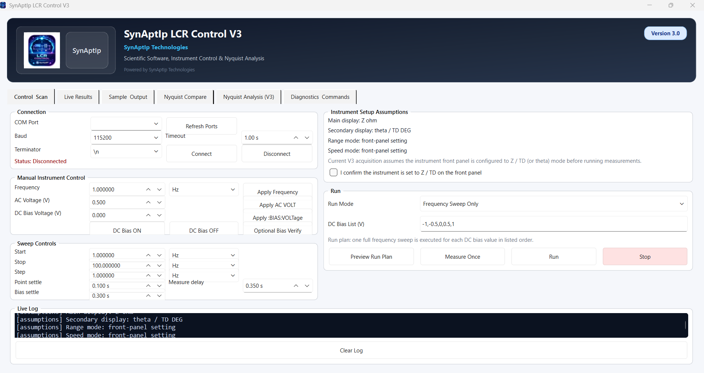

# SynAptIp LCR Control V3  

### Scientific Instrument Control & Nyquist Analysis Platform


[](https://doi.org/10.5281/zenodo.19212713)



**SynAptIp Technologies** · AI · Scientific Software · Instrument Intelligence

---

## Overview

SynAptIp LCR Control V3 is a scientific desktop application for impedance workflows and Nyquist visualization.

It is compatible with LCR instruments supporting SCPI communication and is designed for general-purpose impedance analysis workflows. The platform supports standard measurement protocols used in LCR instrumentation, including automated frequency sweeps, optional DC bias sequencing, and post-processing exports.

V3 is an additive evolution of the stable V2.3 line. Existing V2.3 behavior is preserved, while V3 adds a dedicated Nyquist analysis and export layer.

---

## Key Features

| Feature | Details |
|---|---|
| Instrument communication | SCPI serial communication over standard COM interfaces |
| Frequency sweep automation | Configurable start / stop / step with selectable units (Hz, kHz, MHz) |
| DC bias control | Per-sweep bias list workflow with settle delays |
| Single measurement | One-shot FETC? acquisition for quick checks |
| Live results display | Real-time table with Z, theta, and status columns |
| CSV export | Structured per-run export with sample metadata |
| Nyquist transform | z_real / z_imag computation from Z-theta raw data |
| Nyquist plot (individual) | 300 dpi JPG per file with timestamped naming |
| Nyquist plot (comparison) | Overlay of up to 3 datasets in a single 300 dpi JPG |
| Export ALL | One-click CSV + individual JPG + comparison JPG |
| Offline-first architecture | Local processing with no cloud dependency |
| Trial / license system | 14-day trial and offline activation support |
| Windows EXE distribution | Single-file .exe via PyInstaller |

---

## Scientific Positioning

SynAptIp LCR Control V3 is positioned as a general-purpose scientific software platform for:

- Impedance analysis and Nyquist interpretation
- Repeatable frequency-domain characterization workflows
- Structured data generation for reports and publication pipelines
- Research and engineering environments requiring offline-capable instrumentation software

The software provides analysis and export capabilities without claiming site-specific deployment or institution-specific validation.

---

## Use Cases

- Electrical characterization workflows
- Materials science impedance studies
- Electrochemistry data processing
- Semiconductor analysis support
- Instrumentation automation for repeatable measurement sequences

---

## Installation (Development)

Requires Python 3.11+ and Git.

```bash
git clone https://github.com/your-org/SynAptIp-LCR-Link-Tester.git
cd SynAptIp-LCR-Link-Tester

python -m venv .venv
.venv\Scripts\activate

pip install -r requirements.txt
pip install matplotlib
```

Run from source:

```bash
python src_v3/lcr_control_v3.py
```

Optional development bypass for the trial dialog:

```bash
$env:SYNAPTIP_LICENSE_DISABLED="1"
python src_v3/lcr_control_v3.py
```

---

## Build Executable

Build the Windows executable:

```bat
.\build_v3.bat
```

Output:

```text
dist\SynAptIp_LCR_Control_V3.exe
```

---

## Running the Software

* Double-click `SynAptIp_LCR_Control_V3.exe`
* On first launch, a 14-day trial period is automatically activated
* To unlock full functionality, enter a valid activation key in the license dialog
* You may continue using the software during the trial period by selecting "Continue Trial"

License and activation data are securely stored on the local system.

---

## Scientific Output

### Nyquist Plots (JPG, 300 dpi)

Individual plot per input file:

```text
exports_v3/<sample>_nyquist_YYYYMMDD_HHMMSS.jpg
```

Comparison overlay plot (2-3 files):

```text
exports_v3/nyquist_compare_YYYYMMDD_HHMMSS.jpg
```

### Structured CSV Export

Per-run output includes fields such as:

- `freq_hz`
- `z_ohm`
- `theta_deg`
- `z_real`
- `z_imag`
- `minus_z_imag`
- sample metadata and run timestamps

---

## Scientific Methodology

Detailed computational methodology is documented in:

- [docs/methodology/nyquist_method.md](docs/methodology/nyquist_method.md)

---

## Example Datasets and Workflow Validation

Illustrative example datasets and workflow-validation documentation are available at:

- [docs/validation/validation_protocol.md](docs/validation/validation_protocol.md)
- [docs/validation/dataset_import_log.md](docs/validation/dataset_import_log.md)
- [docs/validation/validation_log.txt](docs/validation/validation_log.txt)
- [example_data/](example_data/)
- [example_outputs/](example_outputs/)

---

## Reproducibility

Step-by-step reproducibility instructions are available in:

- [docs/reproducibility/run_example.md](docs/reproducibility/run_example.md)

### Scientific Basis

SynAptIp Nyquist Analyzer V3.5 extends the existing impedance workflow with a release-hardened Analysis & Insights module for offline EIS post-processing.

Nyquist analysis plots the real part of impedance on the horizontal axis and the negative imaginary part on the vertical axis:

$$
Z' = |Z| \cos(\theta)
$$

$$
Z'' = |Z| \sin(\theta)
$$

Where:

- $Z'$ is the real impedance component
- $Z''$ is the imaginary impedance component
- Nyquist plots use $-Z''$ on the vertical axis by convention
- Bode magnitude plots show $|Z|$ as a function of frequency
- Bode phase plots show $\theta$ as a function of frequency

The V3.5 analysis output also includes derived frequency-domain views of $Z'$, $-Z''$, admittance, and capacitance when the dataset supports those transformations.

### Validation

V3.5 includes a dedicated validation dataset in [validation](validation) using:

- [validation/rc_example.csv](validation/rc_example.csv)
- [validation/rc_dcbias_example.csv](validation/rc_dcbias_example.csv)

The validation workflow runs the full release pipeline: schema detection, impedance transformation, cleaning, plot generation, interpretation, and metadata export.

Cleaning rules applied by the release pipeline are:

- invalid status removal when a status column is present
- non-finite value removal in required analysis columns
- non-positive frequency removal
- percentile-based outlier filtering, per DC bias group when applicable

The interpretation report is heuristic and should not be treated as a definitive scientific conclusion. It is designed to provide cautious, machine-generated guidance for review.

### Reproducibility

The V3.5 release workflow is reproducible with the bundled validation data:

1. Load a CSV file in the Analysis & Insights tab.
2. Choose the output folder.
3. Run analysis.
4. Inspect the generated `run_YYYYMMDD_HHMMSS` folder.
5. Review `cleaned/`, `figures/`, `report/`, and `metadata/metadata.json`.

For scripted verification, run the validation script from the repository root:

```bat
c:/Projects/SynAptIp-LCR-Link-Tester/.venv/Scripts/python.exe validation/validate_v3_5.py
```

---

### Scientific Publication (Draft)

This repository includes a structured scientific documentation draft:

- Abstract
- Introduction
- Methods
- Results
- Discussion
- Conclusion

Located in:

- [docs/paper_support/](docs/paper_support/)

---

## Citation

If you use this software in academic or scientific work, please cite:

Ramírez Martínez, D. (2026). *SynAptIp LCR Control V3: Scientific Instrument Control & Nyquist Analysis Platform* (Version 3.0.0) [Software]. Zenodo. https://doi.org/10.5281/zenodo.19212714

---

## DISCLAIMER

This software is an independent development by SynAptIp Technologies.

It is not affiliated with, endorsed by, or officially connected to any instrument manufacturer, laboratory, or institution.

All product names, trademarks, and registered trademarks are property of their respective owners.

This software is designed as a general-purpose scientific tool for interoperability and data analysis.

---

## Project Structure

```text
src_v3/               # V3 application source
  lcr_control_v3.py   # Entry point
  services/           # Instrument, CSV, Nyquist, licensing services
  ui/                 # PySide6 main window and panels
  docs/               # V3-specific internal docs
packaging/windows/    # EXE metadata version resources
docs/                 # Project-level documentation
assets/icons/         # Application icons
build_v3.bat          # V3 build script
requirements.txt      # Python dependencies
```

---

## License

This software is proprietary and owned by SynAptIp Technologies.

Permission is granted for academic and non-commercial research use only, subject to explicit request and approval by the author.

Commercial use, redistribution, sublicensing, or integration into commercial systems is strictly prohibited without prior written authorization.

No warranty is provided. This software is supplied "as is" without any guarantees of performance or fitness for a particular purpose.

---

## Author

Developed independently by Daniel Ramírez Martínez, SynAptIp Technologies
